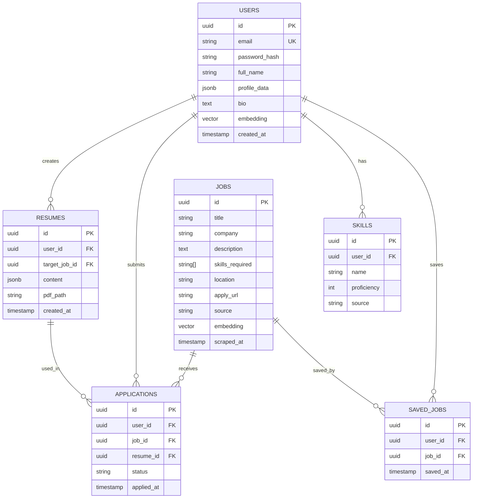

# ApplyIQ — AI-Powered Internship Automation Platform

## Overview

ApplyIQ is a full-stack web application that automates discovering, analyzing, and applying to internships using AI. The platform scrapes internship listings, matches them to user profiles via embeddings, generates tailored resumes & cover letters, tracks skills, and provides a unified dashboard experience.

---

## User Review Required

> [!IMPORTANT]
> **AI API Key**: The app will use the **Google Gemini API** for all AI features (resume generation, cover letter, chatbot, email assistant, job matching embeddings). You'll need a `GEMINI_API_KEY`. Is Gemini acceptable, or do you prefer OpenAI?

> [!IMPORTANT]
> **Database Setup**: The plan uses PostgreSQL + Redis via Docker Compose. Do you have Docker installed, or should we use SQLite for local development instead?

> [!WARNING]
> **Scraping Limitations**: Real-time scraping of LinkedIn/Internshala is fragile and may violate ToS. The plan implements a **mock scraper** with realistic sample data + an architecture that supports real scrapers when API access is available. Is this acceptable for a hackathon demo?

> [!IMPORTANT]
> **Scope Prioritization**: This is an extremely large project (11 features). I'll implement everything, but in phases. The MVP (Phase 1-3) will be fully functional. Do you want me to proceed with all phases, or stop after a working MVP?

---

## Tech Stack

| Layer | Technology |
|-------|-----------|
| Frontend | React 18 + Vite + TypeScript |
| Styling | Tailwind CSS v3 |
| State | Zustand |
| Drag & Drop | @dnd-kit/core |
| Backend | FastAPI (Python) |
| Auth | JWT (python-jose + bcrypt) |
| Database | PostgreSQL (via SQLAlchemy + Alembic) |
| Cache | Redis |
| AI | Google Gemini API (gemini-2.0-flash) |
| Embeddings | Gemini text-embedding-004 |
| PDF Gen | ReportLab / WeasyPrint |
| File Parse | PyMuPDF (PDF) + python-docx (DOCX) |
| Scraping | Playwright (async) |
| DevOps | Docker + Docker Compose |

---

## Folder Structure

```
ApplyIQ/
├── docker-compose.yml
├── .env.example
├── README.md
│
├── backend/
│   ├── Dockerfile
│   ├── requirements.txt
│   ├── main.py                    # FastAPI app entry
│   ├── config.py                  # Settings & env vars
│   ├── database.py                # DB connection & session
│   │
│   ├── models/                    # SQLAlchemy models
│   │   ├── user.py
│   │   ├── job.py
│   │   ├── resume.py
│   │   ├── skill.py
│   │   └── application.py
│   │
│   ├── schemas/                   # Pydantic schemas
│   │   ├── user.py
│   │   ├── job.py
│   │   ├── resume.py
│   │   └── skill.py
│   │
│   ├── routers/                   # API routes
│   │   ├── auth.py
│   │   ├── jobs.py
│   │   ├── resume.py
│   │   ├── cover_letter.py
│   │   ├── skills.py
│   │   ├── chatbot.py
│   │   ├── email_assistant.py
│   │   ├── upload.py
│   │   └── news.py
│   │
│   ├── services/                  # Business logic
│   │   ├── ai_engine.py           # Gemini API wrapper
│   │   ├── job_matcher.py         # Embedding + cosine sim
│   │   ├── resume_generator.py    # AI resume builder
│   │   ├── cover_letter_gen.py    # AI cover letter
│   │   ├── skill_analyzer.py      # Skill gap analysis
│   │   ├── file_parser.py         # PDF/DOCX extraction
│   │   ├── email_writer.py        # Cold email generation
│   │   └── news_scraper.py        # Tech news/trends
│   │
│   ├── scraper/                   # Job scraping
│   │   ├── base_scraper.py
│   │   ├── linkedin_scraper.py
│   │   ├── internshala_scraper.py
│   │   ├── mock_scraper.py        # Demo data
│   │   └── scheduler.py           # Periodic scraping
│   │
│   ├── middleware/
│   │   ├── auth_middleware.py
│   │   └── rate_limiter.py
│   │
│   └── utils/
│       ├── security.py            # JWT + hashing
│       └── pdf_builder.py         # PDF generation
│
├── frontend/
│   ├── Dockerfile
│   ├── package.json
│   ├── vite.config.ts
│   ├── tailwind.config.js
│   ├── index.html
│   │
│   ├── src/
│   │   ├── main.tsx
│   │   ├── App.tsx
│   │   ├── index.css              # Tailwind + custom styles
│   │   │
│   │   ├── api/                   # API client
│   │   │   └── client.ts
│   │   │
│   │   ├── store/                 # Zustand stores
│   │   │   ├── authStore.ts
│   │   │   ├── jobStore.ts
│   │   │   └── uiStore.ts
│   │   │
│   │   ├── components/            # Reusable components
│   │   │   ├── layout/
│   │   │   │   ├── Sidebar.tsx
│   │   │   │   ├── Header.tsx
│   │   │   │   └── Layout.tsx
│   │   │   ├── ui/
│   │   │   │   ├── Button.tsx
│   │   │   │   ├── Card.tsx
│   │   │   │   ├── Modal.tsx
│   │   │   │   ├── Badge.tsx
│   │   │   │   ├── Input.tsx
│   │   │   │   └── SkillBar.tsx
│   │   │   ├── jobs/
│   │   │   │   ├── JobCard.tsx
│   │   │   │   └── JobList.tsx
│   │   │   ├── chat/
│   │   │   │   └── ChatWidget.tsx
│   │   │   └── upload/
│   │   │       └── DragDropUpload.tsx
│   │   │
│   │   └── pages/
│   │       ├── Login.tsx
│   │       ├── Register.tsx
│   │       ├── Dashboard.tsx
│   │       ├── Jobs.tsx
│   │       ├── ResumeBuilder.tsx
│   │       ├── CoverLetter.tsx
│   │       ├── Skills.tsx
│   │       ├── Applications.tsx
│   │       ├── EmailAssistant.tsx
│   │       └── News.tsx
│   │
│   └── public/
│       └── favicon.svg
│
└── data/
    └── sample_jobs.json           # Seed data
```

---

## Proposed Changes — Phased Approach

### Phase 1: Foundation (Backend Core + Auth + Database)

#### [NEW] `docker-compose.yml`
- PostgreSQL 15, Redis 7, backend, frontend services
- Volume mounts, environment variables, health checks

#### [NEW] `.env.example`
- All required env vars documented

#### [NEW] `backend/main.py`
- FastAPI app with CORS, middleware, router registration

#### [NEW] `backend/config.py`
- Pydantic Settings class reading from env

#### [NEW] `backend/database.py`
- SQLAlchemy async engine, session factory, Base model

#### [NEW] `backend/models/*.py`
- User (id, email, password_hash, full_name, profile_data jsonb)
- Job (id, title, company, description, skills[], location, url, source, embedding, scraped_at)
- Resume (id, user_id, content_json, target_job_id, pdf_path, created_at)
- Skill (id, user_id, name, proficiency, source)
- Application (id, user_id, job_id, status, resume_id, applied_at)

#### [NEW] `backend/schemas/*.py`
- Pydantic request/response models for all API endpoints

#### [NEW] `backend/utils/security.py`
- JWT creation/verification, bcrypt password hashing

#### [NEW] `backend/routers/auth.py`
- POST /api/auth/register
- POST /api/auth/login
- GET /api/auth/me

#### [NEW] `backend/middleware/auth_middleware.py`
- JWT dependency injection for protected routes

#### [NEW] `backend/middleware/rate_limiter.py`
- Slowapi-based rate limiting

---

### Phase 2: AI Engine + Job Scraping

#### [NEW] `backend/services/ai_engine.py`
- Gemini API wrapper (chat, generate, embed)
- Structured prompt templates
- Error handling + retry logic

#### [NEW] `backend/services/job_matcher.py`
- Generate embeddings for user profiles and job descriptions
- Cosine similarity ranking
- Match score + AI explanation

#### [NEW] `backend/scraper/mock_scraper.py`
- 50+ realistic internship listings across tech, marketing, design
- Diverse companies, skill requirements, locations

#### [NEW] `backend/scraper/base_scraper.py`
- Abstract base class for scrapers

#### [NEW] `backend/scraper/internshala_scraper.py`
- Playwright-based Internshala scraper (best scraping target)

#### [NEW] `backend/scraper/scheduler.py`
- APScheduler for periodic scraping (every 6-12 hours)

#### [NEW] `backend/routers/jobs.py`
- GET /api/jobs — list jobs (with filters, pagination, caching)
- GET /api/jobs/{id} — job detail
- POST /api/jobs/match — get matched jobs for user
- POST /api/jobs/{id}/save — save job
- GET /api/jobs/saved — list saved jobs

---

### Phase 3: Resume & Cover Letter Generation

#### [NEW] `backend/services/resume_generator.py`
- Analyze job description for key requirements
- Generate ATS-optimized resume sections
- Structured prompt with action verbs, quantifiable achievements
- Return structured JSON for preview + PDF generation

#### [NEW] `backend/services/cover_letter_gen.py`
- Personalized cover letter with company research
- Professional + confident tone
- Why you fit + why company + impact mindset

#### [NEW] `backend/utils/pdf_builder.py`
- ReportLab-based PDF generation
- Professional resume template
- Cover letter template

#### [NEW] `backend/routers/resume.py`
- POST /api/resume/generate — generate tailored resume
- GET /api/resume/{id} — get resume
- GET /api/resume/{id}/download — download PDF
- GET /api/resumes — list user's resumes

#### [NEW] `backend/routers/cover_letter.py`
- POST /api/cover-letter/generate
- GET /api/cover-letter/{id}/download

---

### Phase 4: Skills, Upload, Email, Chatbot

#### [NEW] `backend/services/skill_analyzer.py`
- Extract skills from profile
- Compare against job requirements
- Generate skill gap analysis + learning roadmap

#### [NEW] `backend/services/file_parser.py`
- PDF text extraction (PyMuPDF)
- DOCX text extraction (python-docx)
- AI-powered structured data extraction from resume text

#### [NEW] `backend/services/email_writer.py`
- Cold email to recruiters
- Follow-up email generation
- Personalized with job role, company, user profile

#### [NEW] `backend/routers/skills.py`
- GET /api/skills — user skills
- POST /api/skills/analyze — gap analysis against job
- GET /api/skills/recommendations — learning recommendations

#### [NEW] `backend/routers/upload.py`
- POST /api/upload/resume — upload + parse resume
- POST /api/upload/certificate — upload certificate
- Secure file validation

#### [NEW] `backend/routers/chatbot.py`
- POST /api/chat — conversational AI assistant
- Context-aware with user profile + jobs

#### [NEW] `backend/routers/email_assistant.py`
- POST /api/email/cold — generate cold email
- POST /api/email/followup — generate follow-up

#### [NEW] `backend/routers/news.py`
- GET /api/news/trends — tech trends + hiring insights

---

### Phase 5: Frontend — Complete UI

#### [NEW] `frontend/` (Vite + React + TypeScript + Tailwind)

**Design System:**
- Dark mode with vibrant accent colors (indigo/violet gradient palette)
- Glassmorphism cards with backdrop blur
- Smooth page transitions (Framer Motion)
- Inter font from Google Fonts
- Responsive design (mobile-first)

**Pages:**
1. **Login/Register** — Clean auth forms with animated background
2. **Dashboard** — Overview cards (stats, matched jobs, recent activity, skill progress)
3. **Jobs** — Filterable job list with match scores, save functionality  
4. **Resume Builder** — Select job → AI generates tailored resume → preview → download PDF
5. **Cover Letter** — Similar flow to resume builder
6. **Skills** — Skill radar chart, gap analysis, learning recommendations
7. **Applications** — Kanban-style tracker (Applied, In Review, Interview, Offer, Rejected)
8. **Email Assistant** — Generate cold/follow-up emails
9. **News** — Tech trends + hiring insights feed

**Components:**
- Sidebar navigation with icons
- Floating chat widget (bottom-right)
- Drag-and-drop file upload zone
- Animated skill progress bars
- Job match percentage badges

---

## Database Schema (ERD)



---

## API Overview

| Method | Endpoint | Description |
|--------|----------|-------------|
| POST | /api/auth/register | Register new user |
| POST | /api/auth/login | Login, get JWT |
| GET | /api/auth/me | Current user profile |
| GET | /api/jobs | List jobs (filtered, paginated) |
| POST | /api/jobs/match | AI-matched jobs for user |
| POST | /api/jobs/{id}/save | Save a job |
| POST | /api/resume/generate | Generate tailored resume |
| GET | /api/resume/{id}/download | Download resume PDF |
| POST | /api/cover-letter/generate | Generate cover letter |
| GET | /api/skills | User skills |
| POST | /api/skills/analyze | Skill gap analysis |
| POST | /api/upload/resume | Upload & parse resume |
| POST | /api/chat | AI chatbot |
| POST | /api/email/cold | Cold email generator |
| POST | /api/email/followup | Follow-up email generator |
| GET | /api/news/trends | Tech trends |

---

## Open Questions

> [!IMPORTANT]
> 1. **Gemini vs OpenAI** — Which AI provider do you prefer? Plan defaults to Gemini (free tier available).

> [!IMPORTANT]
> 2. **Docker vs Local** — Do you have Docker installed? If not, I'll set up with SQLite + in-memory cache for local dev.

> [!IMPORTANT]
> 3. **Scope** — Should I build everything in one go, or would you prefer a working MVP first (auth + jobs + resume + dashboard) and iterate?

---

## Verification Plan

### Automated Tests
- Start backend with `uvicorn` and verify all API endpoints respond
- Start frontend with `npm run dev` and verify pages render
- Test auth flow (register → login → access protected routes)
- Test resume generation endpoint
- Browser-based UI verification for key pages

### Manual Verification
- Navigate through all pages in browser
- Test complete user flow: Register → Upload Resume → Browse Jobs → Generate Resume → Download PDF
- Verify responsive design on different viewport sizes
- Test chatbot interaction
